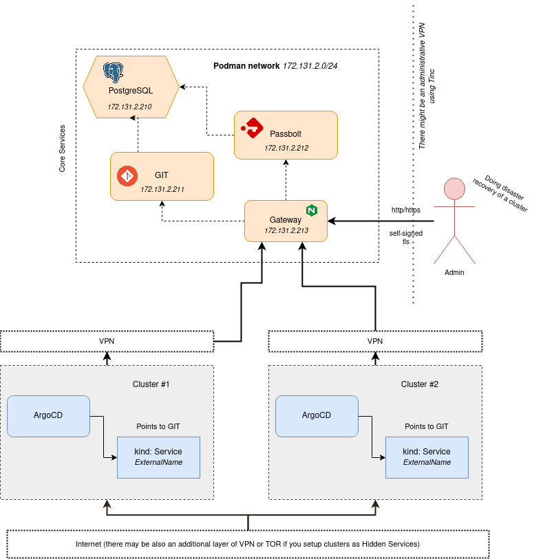

core-services
=============

Every tech organization's core services - GIT and Password manager.

Why?
----

To setup an infrastructure from code there are needed two independent services:
- GIT: To checkout the code
- Password manager: To decrypt secrets required to perform initial deployment

**Podman instead of Docker?** - Its more lightweight than docker (does not require daemon), secondly Kubernetes does not use docker, it's no longer best for production.

Architecture
------------



- Every service is a Podman container started by systemd
- **Gateway** is a reverse proxy that exposes services on standard 80 and 443 ports with a self-signed TLS certificate under valid domains, just in case of a Disaster Recovery. For a regular gateway use e.g. Kubernetes `kind Service` + `kind: Ingress` to expose an external service
- Static IP is assigned for each service
- Uses virtual network with constant subnet
- It is possible to place every service on a different machine, it would require a routing/VPN configuration and creation of a Podman subnet per machine
- Bind mount volumes are used to store application's data on host's disk at `/var/lib/riotkit-core`

Gitea
-----

Lightweight GIT server, easy to maintain, full of features.

**Purpose:** To be able to fetch cluster configuration in disaster recovery process

Passbolt
--------

Secure password manager with End-To-End (in browser) encryption using well know, audited GPG.

**Purpose:** To decrypt credentials stored in GIT, required during deployment time

**Notice:** The Passbolt image is built on runtime, old images are deleted. Reason for this is to add a PostgreSQL library to be able to connect to database.

Gateway
-------

Simple HTTP and HTTPS reverse proxy. Exposes services under given domain/subdomain names. Uses self-signed certificates for TLS.

**Purpose:** Access Gitea and Passbolt simply by switching IP address in `/etc/hosts` during recovery process

### Security

The gateway is exposed by default for 0.0.0.0 (all interfaces), but is limited for selected subnets using UFW firewall.

```yaml
ufw_allow_forwarded_ports_access_from:
    - 10.0.0.0/8
    - 172.0.0.0/8
    - 127.0.0.0/24
```

#### How to access forwarded ports? (80, 443)

When your cluster or something will go down and you need to access the services alternatively, there are recommendations:

- **VPN case:** Assuming you have VPN at `10.180.5.0/24` you can connect via VPN, set `10.180.x.y git.myhost.org` in local `/etc/hosts` for disaster recovery time to access services
- **Port forward case:** You can port-forward 80 and 443 to your local computer using SSH tunneling, then in local `/etc/hosts` set e.g. `127.0.0.1 git.myhost.org`

#### Self-signed certificates, HSTS NOTICE

Assuming that your domain had enabled **HTTP Strict Transport Security**, and you needed to redirect the DNS name to your disaster recovery IP - the self-signed certificate
will collide with the previously enabled HSTS. **Use incognito mode to access your domain in disaster recovery case.**

PostgreSQL
----------

A dependency to Passbolt and Gitea.

Exposing service using Kubernetes
---------------------------------

Use `Service`, `Endpoint` and `Ingress` to expose a core service within Kubernetes to the world, or at least to the cluster.

**Benefits of exposing service via Kubernetes:**
- Automatic TLS certs generation using `certs-manager`
- IP address access control
- Web Application Firewall integrated in NGINX controller

```yaml
---
apiVersion: v1
kind: Service
metadata:
   name: http
   namespace: git
spec:
    ports:
        - name: http
          protocol: TCP
          port: 80
          # container port or host IP port (depending on IP you are pointing at)
          targetPort: 3000

---
apiVersion: v1
kind: Service
metadata:
   name: ssh
   namespace: git
spec:
    ports:
        - name: ssh
          protocol: TCP
          port: 2222
          
          # container port or host IP port (depending on IP you are pointing at)
          targetPort: 2222
    externalTrafficPolicy: Cluster
    internalTrafficPolicy: Cluster
    type: LoadBalancer
    allocateLoadBalancerNodePorts: true

---
apiVersion: v1
kind: Endpoints
metadata:
    name: "http"
    namespace: "git"
subsets:
    - addresses:
          # use container IP (if reachable on the network from other machine) or IP of a host machine, where container is running and have a port forwarded to (and not blocked on firewall)
          - ip: "172.131.2.211"  
      ports:
          # container port or host IP port (depending on IP you are pointing at)
          - port: 3000
            name: "http"

---
apiVersion: v1
kind: Endpoints
metadata:
    name: "ssh"
    namespace: "git"
subsets:
    - addresses:
          # use container IP (if reachable on the network from other machine) or IP of a host machine, where container is running and have a port forwarded to (and not blocked on firewall)
          - ip: "172.131.2.211"
      ports:
          # container port or host IP port (depending on IP you are pointing at)
          - port: 2222
            name: "ssh"
```

Enjoy!
------

We are a grassroot, tech collective and made this project to fulfill needs of anarchist, anticapitalist, grassroot collectives.
